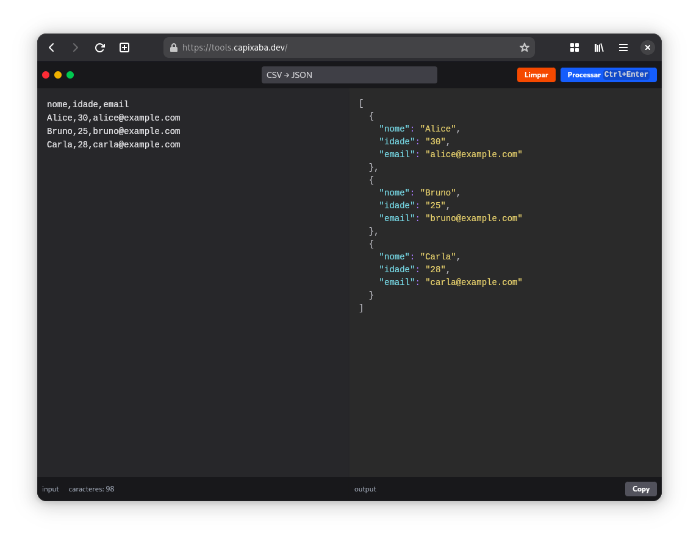

# Text Tools 💬

Text Tools is a collection of text processing tools that can be used to manipulate and transform text in various ways. The tools are designed to be simple and easy to use, with a focus on providing a wide range of functionality.

> Inspired by the Swiss Army Knife of text processing [Text Pieces](https://github.com/liferooter/textpieces)



## How to run

1. Install the dependencies:

```bash
bun install # or `npm install`
```

2. Run the app:

```bash
bun run dev # or `npm run dev`
```
or

```bash
bun run dev:host # or `npm run dev:host`
```

> Note: `dev:host` will allow you to access the app from other devices on your local network. You can find the host address in the terminal output after running the command.

3. Open the app in your browser:

[http://localhost:5173](http://localhost:5173)

